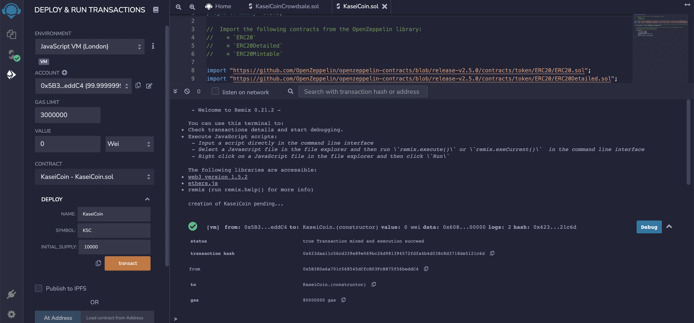

# Unit 21: Martian Token Crowdsale

## KaseiCoin

KaseiCoin a new cryptocurrency developed to be used by the first human colony on MARS. This new monetary system, for the new Mars colony, is based on blockchain technology.

## Usage

KaseiCoin is a fungible token that is ERC-20 compliant and that can be minted by using a Crowdsale contract from the OpenZeppelin Solidity library.

To accomplish this 3 contracts have been created:

### KaseiCoin token contract

### KaseiCoin crowdsale contract

### KaseiCoin deployer contract

Pre-production testing of the crowdsale was perfomed by deploying the crowdsale to a local blockchain using Remix, MetaMask, and Ganache.

## Evaluation Evidence

### KaseiCoin token contract Compile & Deployment

 

### KaseiCoin crowdsale contract Compile & Deployment

 

### KaseiCoin deployer contract Deployment

### KaseiCoin token mint

Contributing
Pull requests are welcome. Please open an issue to discuss before executing any changes. Please make sure to update tests as needed.

### License MIT
